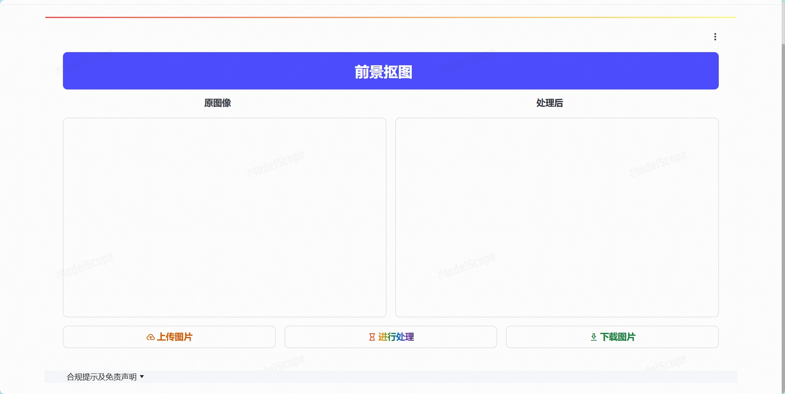
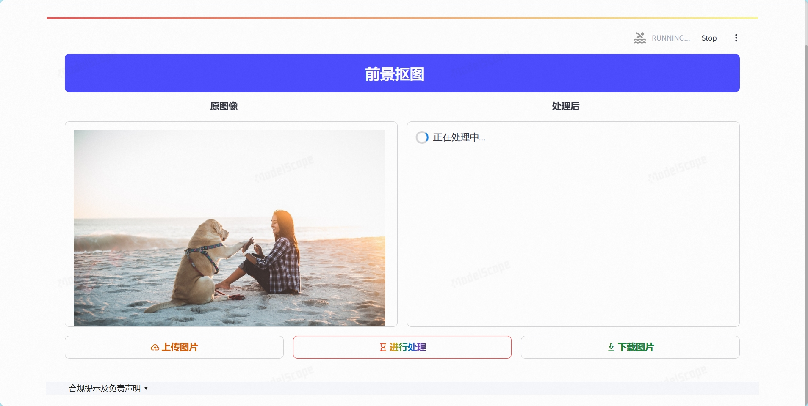
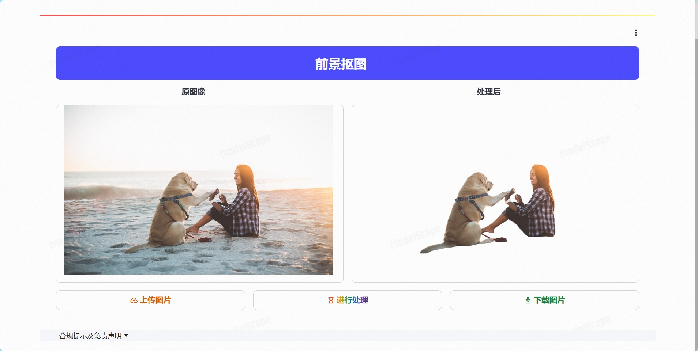
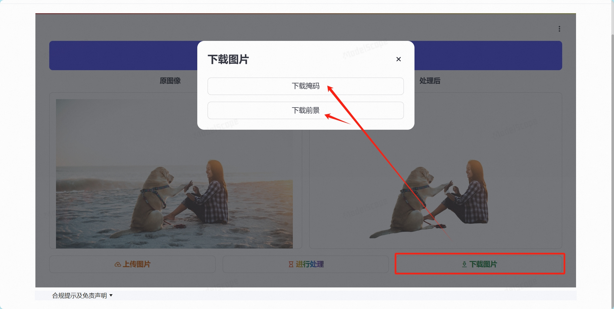

<div align="center">
<h1>
Removing Background of image is so EASY.
<h1>

<h3>

[Homepage](https://github.com/LixiangHello/RemoveBackground) | [modelscope space](https://www.modelscope.cn/studios/Lixiang/RMBG-2.0/summary?header=default&fullWidth=false) | [streamlit](https://streamlit.io/) | [RMBG-2.0](https://github.com/Efrat-Taig/RMBG-2.0)

</h3>

</div>


## install 
```shell
pip install -r requirements.txt
```
## launch WEBUI
```shell
streamlit run app.py --server.runOnSave true --server.port 6006 --runner.magicEnabled false --client.toolbarMode viewer
```

## demo image






